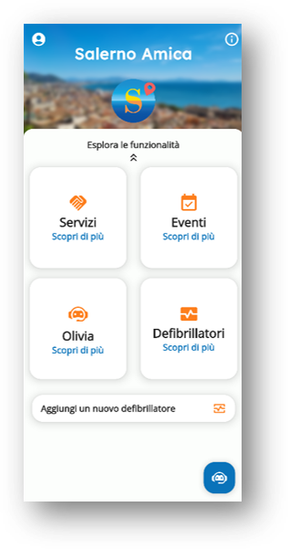
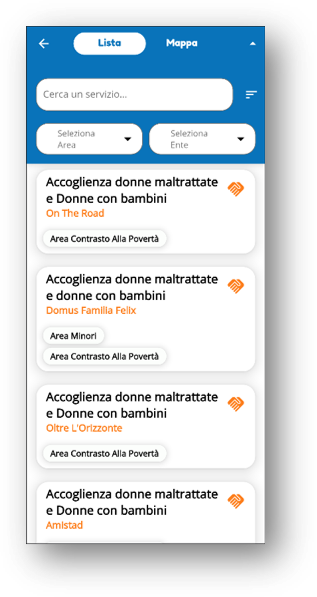
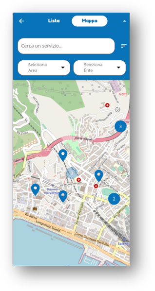
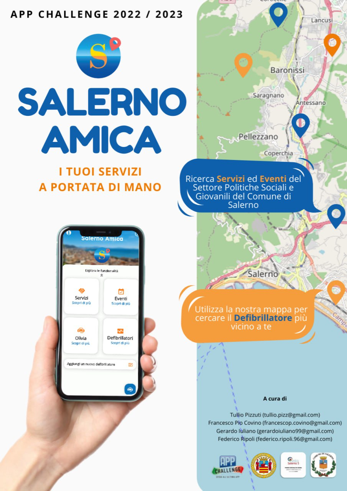

# **Salerno Amica**

## App Challenge 2022/2023 
### Corso Enterprise Mobile Application Development
### Università Degli Studi di Salerno - Dipartimento di Informatica
---
### Team 👋

- <a href="https://github.com/frapiocov" target="_blank">Covino Francesco Pio</a>
- <a href="https://github.com/GerardoIuliano" target="_blank">Gerardo Iuliano</a>
- <a href="https://github.com/tulliopizzuti" target="_blank">Pizzuti Tullio</a>
- <a href="https://github.com/FedericoRipoli" target="_blank">Ripoli Federico</a>
---
## Che cos'è Salerno Amica? 🤌🏻
Un'applicazione cross-platform, sviluppata in Flutter e Spring. E' un punto di aggregazione per tutti i Servizi offerti dal settore delle Politiche Sociali e Giovanili del Comune di Salerno. L'app mostra tutti gli eventi e i defibrillatori disponibili nella zona di Salerno. Il cittadino potrà contribuire alla mappatura dei defibrillatori segnalandone la presenza tramite un apposito form di richiesta. Tutte le informazioni e i dati presenti sull'app vengono controllate e approvate dal Comune.

---
## Funzionalità dell'app 📋
- Ricerca di eventi e servizi tramite filtri
- Georeferenziazione di servizi e defibrillatori su una mappa
- Inserimento e gestione dei defibrillatori
- Supporto all'utilizzo dell'applicazione tramite ChatBot
- Gestione autonoma dei servizi con dashboard ente
- Gestione e supervisione da parte di un admin comunale

---
## Screenshot dell'applicazione 📱

    
    
    

---
## Tecnologie Utilizzate 🧑‍💻
- Flutter
- Spring
- MySQL
- OpenStreetMap
- Olivia Open AI
- Firebase

---
## Locandina per l'evento 📰

---
## Scarica l'app ⬇️
*N.B. attualmente solo per dispositivi Android*
### <a href="docs/SalernoAmica.apk" download>scarica l'apk</a>  o <a href="https://www.youtube.com/watch?v=dQw4w9WgXcQ&ab_channel=RickAstley" target="_blank">clicca qui</a>